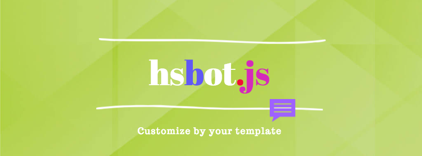

<h1 align="center">
  
  <br>
</h1>

[](https://travis-ci.org/hrdk108/hsbot)
[](https://coveralls.io/github/hrdk108/hsbot?branch=master)
[](https://www.npmjs.com/package/hsbot)
[](https://www.npmjs.com/package/hsbot)
[](https://snyk.io/test/github/hrdk108/hsbot)
[](https://github.com/hrdk108/hsbot/blob/master/LICENSE)


## Description

Pass your custom template and you are ready to use your own bot.

## Features

- Pass custom template. Template should be in format as defined.
- You can integrate with your system easily.
- Analyze user chat history.

## Install

```
$ npm install hsbot -g
```
## Usage

```
Usage: hsbot
```
Now you are ready to use hsbot.

## Points to keep in mind and example to integrate

* __userId__: UserId is mandatory.
* __userName__: *(optional)* If pass it will not ask you about your name. If not passe, hsbot will ask you about your name first.
* __topicList__ and __topics__: These two files you need to pass to the constructor of hsbot. You can find template under __hsbot -> db -> data__
* __Template__: [topicList.json](https://github.com/hrdk108/hsbot/blob/master/db/data/topicList.json) and [topics.json](https://github.com/hrdk108/hsbot/blob/master/db/data/topics.json)

__Example:__

```
var topicList = require('../db/data/topicList.json'); // Your file path as per defined template.
var topics = require('../db/data/topics.json'); // Your file path as per defined template.
const HSBot = require('hsbot');
const hsBot = new HSBot(topicList, topics);
var userId = "aQ11zyTr4u7I";
var userName;
 
// userId (Mandatory)
// userName (User Name)
// human_text (Your answer/query, the question asked by HSBot)


hsBot.transformAndReply(userId, userName, human_text, function(err, data){
  console.log("HSBot:", data);
});

```

## Analysis

There are multiples APIs are available to analyze user's activities.
You can use following methods.

* __hsBot.getUserAnalysis(userId)__
	> This function will return analysis of particular user as follow:
	```
	{
		"timeSpent": "100261",
		"frequentBotText": "Thank you for contacting us. you can call me by typing @hs anytime for further help.",
		"frequentUserText": "@hs"
	}
	```

* __hsBot.getChatHistory(userId)__
	> This function will return whole user object along with activities.

* __hsBot.getAllUserChatHistory()__
	> This function will return all user object along with activities.